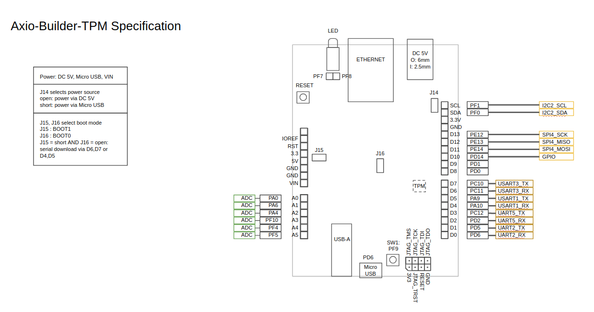
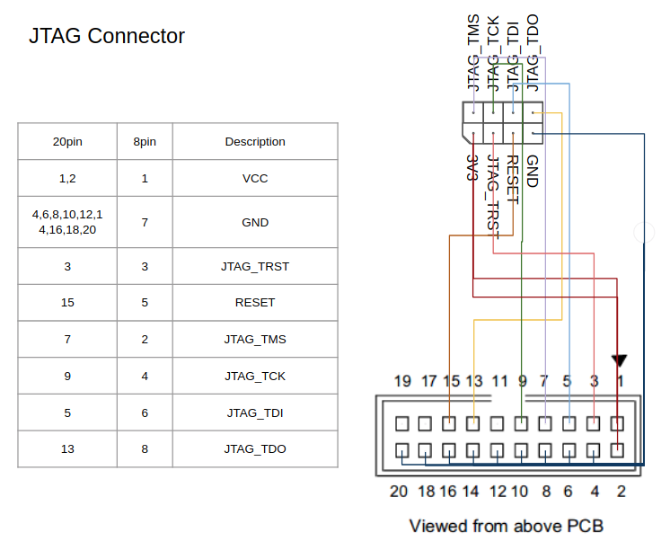

# axio-builder-tpm-with-axiobootmanager

This is source code containing running code on Security Platform Inc.'s Axio-Builder-TPM board.

Axio-Builder-TPM is a reference board with STSAFE-TPM and STM32F4 MCU.

Axio-Builder-TPM comes with pre-installed bootloader, named as Axio-BootManager.

When power is on, bootloader runs first. It checks firmware’s integrity against public key stored in OTP area of MCU.
If if fails, bootloader refuses to boot-up. In a certain circumstances, it recovers compromised firmware with healthy one.

To update firmware of Axio-Builder-TPM, axtool and axsign come with the board.
Axtool is used to install owner’s public key to Axio-Builder-TPM and
Axsign is used to add signature to firmware file for Axio-BootManager to verify it.
Axtool and Axsign is provided in dist/axtool/. Users can choose tool according to their platform.
Linux and MS-Windows are supported, but MAC is not supported now.

## Tree Structure

* dist/ : tools provided by Security Platform Inc.
* axio-builder-tpm.ioc : project file for STM32CubeMX. Users can change development environment or hardware configuration.
* Drivers/TisTpmDrv
* Middlewares/CryptoAPI
* Middlewares/Urchin : fork from https://github.com/LordOfDorks/security-1.git
* Middlewares/Third_Party/mbedTLS : From Drivers/TisTpmDrv to this line are parts for TPM driving.
* Src/ : application files.

## Usage

1. build application
 * run:
 
   ` cd axio-builder-tpm-with-axiobootmanager `
 
   ` make `
 
2. flash image
 * Connect USB cable to MicroUSB connector of Axio-Builder-TPM board.
 * Confirm the port is /dev/ttyUSB0. If not, you have to inform axtool of the tty path recognised.
 * install st-flash, the source code is available at https://github.com/texane/stlink.git
 * run ` make flash ` or `make AXTTY=/dev/ttyUSB0 flash`

3. run application
 * If `SW1` is pressed, the firmware start provisioning process.
 * If `SW1` is not pressed, the firmware shows example usage.
 * You can 

## Axtool/Axsign Usage in x86_64 Linux Env.

### Update firmware

1. connect Axio-Builder-TPM via microUSB connector.
1. `make flash`
1. when "Please reset the board" appears, push reset button

### Install owner's public key
 * public key is dist/axtool/public.pem and private key is dist/axtool/private.pem
  * These keys are just for development or evaluation. **Don't use these keys for important device!!!**
  
   ` dist/axtool/linux_64bit/axtool -i dist/axtool/public.pem`

### generate owner's key pair
 
   `openssl ecparam -genkey -name prime256v1 -noout -out private.pem`

   `openssl ec -in private.pem -pubout -out public.pem`

## Board specification

### JTAG cable specification

### Serial download

Axio-Builder allows users to use serial download feature which STM32F4 MCU offers. With this feature users can update bootloader or other firmware without bootloader neither JTAG. 
1. Prepare USB-UART convertor. You can find it easily on on-line market.
1. Open J16
1. Run ST-Link. This program is available at https://www.st.com/en/development-tools/stsw-link004.html
1. Download your application. If it fails, run ST-Link immediately after pushing reset button.
1. In Linux environment, you can use tool from https://git.code.sf.net/p/stm32flash/code
1. After download, make J16 short and power-up Axio-Builder-TPM.

#### Flashing Axio-BootManager
You can flash Axio-BootManager yourself. Use dist/axtool/axio_builder_stm32_loader.dev.1.0.0.bin.

You have to flash Axio-BootManager in 2 places. Ths addresses are 0x8000000 and 0x8100000. Because Axio-BootManager uses bank switching in every firmware update, unless you flash Axio-BootManager in two addresses, the application will not work after second application firmware update.
