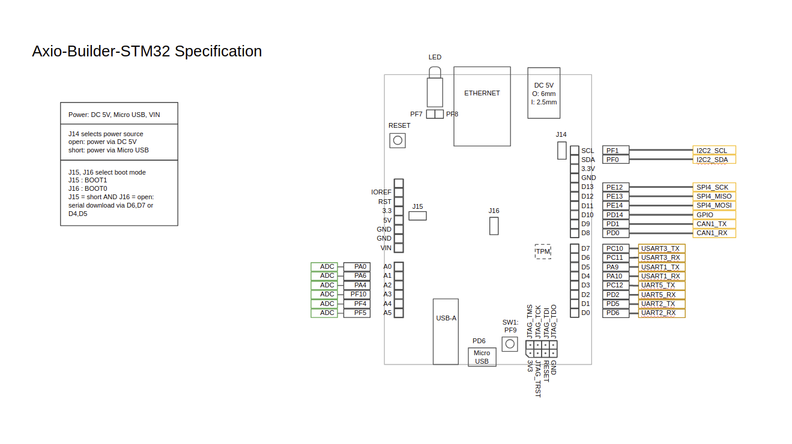

# axio-builder-tpm-with-axiobootmanager

This is source code containing running code on Security Platform Inc.'s Axio-Builder-TPM boad.

Axio-Builder-TPM is a reference board with STSAFE-TPM and STM32F4 MCU.

Axio-Builder-TPM comes with pre-installed bootloader, names as Axio-BootManager.

When power is on, bootloader runs first. It checks firmware’s integrity against public key stored in OTP area of MCU.
If if fails, bootloader refuses to boot-up. In a certain circumstances, it recovers compromised firmware with healthy one.

To update firmware of Axio-Builder-TPM, axtool and axsign come with the board.
Axtool is used to install owner’s public key to Axio-Builder-TPM and
Axsign is used to add signature to firmware file for Axio-BootManager to verify it.
Axtool and Axsign is provided in dist/axtool. Users can choose tool according to their platform.
Linux and MS-Windows are supported, but MAC is not supported now.

## Tree Structure

* dist/ : tools provided by Security Platform Inc.
* axio-builder-stm32.ioc : project file for STM32CubeMX. Users can change development environment or hardware configuration.
* Drivers/TisTpmDrv
* Middlewares/CryptoAPI
* Middlewares/Urchin : fork from https://github.com/LordOfDorks/security-1.git
* Middlewares/Third_Party/mbedTLS : From Drivers/TisTpmDrv to this are parts for TPM driving.
* Src/ : application files.

## Usage in x86_64 Linux Env.

### Update firmware

1. connect Axio-Builder-TPM via microUSB connector.
1. cd axio-builder-tpm-with-axiobootmanager
1. make flash
1. when "Please reset the board" appears, push reset button

### Install owner's public key
 * public key is dist/axtool/public.pem and private key is dist/axtool/private.pem
  * These keys are just for development or evaluation. Don't use these keys for important device!!!
  
` dist/axtool/linux_64bit/axtool -i dist/axtool/public.pem`

### generate owner's key pair
 
`openssl ecparam -genkey -name prime256v1 -noout -out private.pem`

`openssl ec -in private.pem -pubout -out public.pem`

## Board specification

